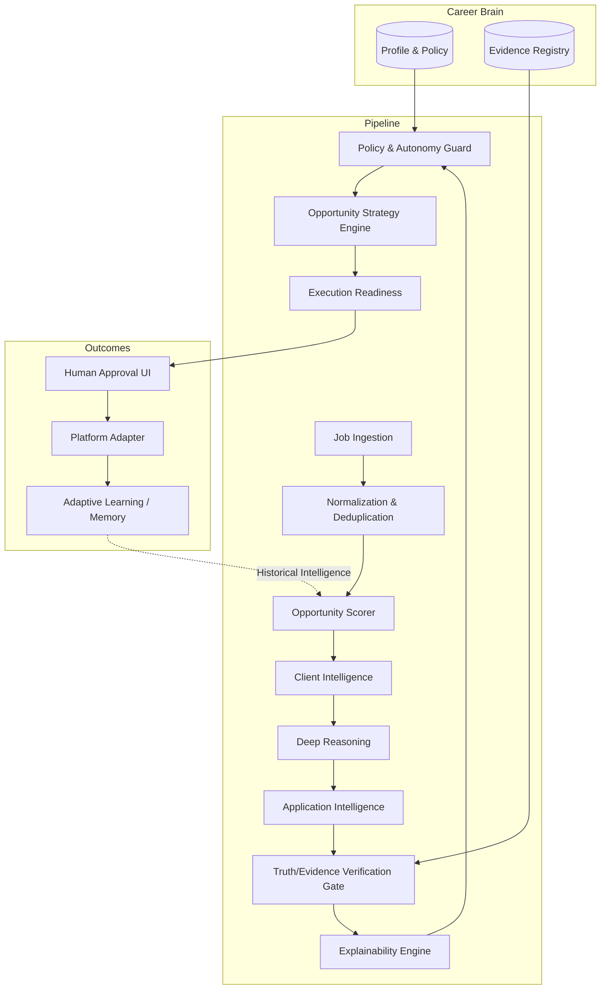

# AutoGig

<div align="center">
  <h3>Evidence-Grounded Autonomous Career Agent</h3>
  <p>A deterministic, local-first AI system that discovers, evaluates, verifies, and strategizes freelance opportunities while strictly bounding AI autonomy within user-defined policies and verifiable truths.</p>
</div>

---

## ⚠️ Hackathon Note: Current Phase (G4.12)
AutoGig is a multi-phase engineering project. The current stable release (`phase-g4.12-stable`) represents a fully functional local-first intelligence architecture. 

**What this means:**
- **Intelligence logic** (scoring, reasoning, filtering, strategy, evidence validation, policy gating, human-in-the-loop, adaptive learning) is **fully implemented and runtime-integrated.**
- **Platform integrations** (Upwork, Fiverr) are currently abstracted via a `LocalDemoPlatformAdapter`. Real API submission is a planned production roadmap feature.
- **AI Providers** execute locally using a `MockAIProvider` (deterministic) for reproducible pipelines, with a `GeminiAIProvider` interface prepared for cloud execution.

---

## The Problem
Traditional AI automation tools for freelancers optimize for volume rather than truth or safety. They suffer from:
- **Hallucination:** Fabricating skills, inventing project experience, or hallucinating certifications.
- **Economic Ignorance:** Ignoring client counter-party risk, budget viability, and historical success rates.
- **Unsafe Autonomy:** Blindly submitting proposals or agreeing to scope changes without human-in-the-loop review.
- **Static Workflows:** Proposing to every job identically instead of tailoring strategy based on freshness, priority, or policy.

## The Solution
AutoGig is not a "proposal generator." It is a **bounded intelligence agent**. 

In AutoGig, **AI is not the ultimate authority**.
1. **AI** proposes intelligence and drafts.
2. **Deterministic Engines** constrain the AI's output.
3. **The Career Brain (Evidence Registry)** validates every claim against known truths.
4. **The Policy Guard** authorizes the action.
5. **Human Approval** explicitly controls sensitive actions (like negotiation and final submission).
6. **Adaptive Learning** monitors realized outcomes to adjust future scoring safely.

## Core Architectural Principles

| Principle | Meaning |
| :--- | :--- |
| **Truth First** | Claims must be explicitly verified against the canonical Evidence Registry. |
| **Policy Bounded Autonomy** | AI cannot override user-defined negotiation limits, blocked clients, or rate minimums. |
| **Deterministic Safety** | Policy validation, schema validation, and state machine transitions are purely deterministic, never delegated to LLMs. |
| **Local First** | Entire pipeline runs offline on SQLite. Reproducible, fast, and entirely hackable. |
| **Human-in-the-Loop** | Critical decisions pause for human approval (`READY_FOR_HUMAN_APPROVAL` state). |
| **Provider Abstraction** | Business logic is decoupled from both the AI Provider and the Job Platform. |

---

## Architecture Flow



## Decision Flow Detail

Every opportunity passes through a strict gauntlet before any action is taken:

`Opportunity` 
→ `Base Evaluation` (Technical/Budget Fit) 
→ `Client Trust` (Risk assessment) 
→ `Evidence Coverage` (Can we prove we can do this?) 
→ `Historical Intelligence` (Have we succeeded here before?) 
→ `Strategy` (Apply Now, Negotiate, Skip) 
→ `Policy Guard` (Is this permitted?) 
→ `Execution Readiness` (Are we missing artifacts?) 
→ `Action` (Draft / Request Human Approval)

---

## Key Capabilities

### 1. Truth & Evidence Verification Gate
AutoGig prevents hallucinated proposals. Before an AI-drafted proposal reaches a human, it passes through the `VerificationGate` and `UserEvidenceResolver`.
*   **User possesses**: `React`, `Node.js`
*   **Job requires**: `React`, `Python`
*   **Verification output**: `React` → `SUPPORTED`, `Python` → `UNSUPPORTED`. The proposal is flagged for human intervention or dropped if policy dictates strict coverage.

### 2. Career Brain (Canonical Context)
The `UserIntelligenceContextLoader` injects a single source of truth across the pipeline. It stores identity, commercial bounds (min/target rates), autonomy levels, and blocked constraints. If you block a client in your Career Brain, the `ClientIntelligenceEngine` instantly rejects their jobs in the worker pipeline.

### 3. Application & Conversation Intelligence
The `ApplicationIntelligenceEngine` maps authentic experience directly to job requirements, generating a `TailoredResume`. The `ConversationIntelligenceEngine` safely structures replies and counter-offers, ensuring the AI never agrees to scope outside of user bounds.

### 4. Policy, Strategy & Execution Readiness
*   **PolicyGuard**: Deterministically outputs `AUTO_EXECUTE`, `AUTO_DRAFT_ONLY`, `REQUIRE_HUMAN_APPROVAL`, or `BLOCK_ACTION`.
*   **OpportunityStrategyEngine**: Synthesizes freshness, expected value, and historical success to output bounds like `APPLY_NOW` or `WAIT_FOR_MORE_INFORMATION`.
*   **ExecutionReadinessEngine**: The final lock. Even if strategy says "Apply", if evidence is missing, it sets state to `READY_TO_DRAFT` rather than execution.

### 5. Outcome Memory & Adaptive Learning
The `AdaptiveLearningEngine` logs past wins and losses. When evaluating a new job, it fetches highly similar historical `OutcomeRecords`. If past jobs with similar parameters routinely ended in non-payment, the engine deterministically downgrades the opportunity score. *Crucially: History can adjust scores, but it can never override hard Policy Guard rejections.*

---

## Local-First & Production Portability

AutoGig operates entirely offline today via **SQLite**. 
*   **Why?** Zero-cost setup, high reproducibility, easy deterministic testing, and no cloud dependencies during the hackathon/demo phase.
*   **Migration Path:** The architecture uses the Repository Pattern (`SQLiteOtherRepositories`). To migrate to production, one simply creates `PostgresOtherRepositories` implementing the exact same domain interfaces, entirely untouched by the core `@autogig/engine`.

---

## Repository Structure

```
├── apps/
│   ├── ingestion-worker/    # Bounded cron polling jobs & transforming into events
│   ├── opportunity-worker/  # The main pipeline executing intelligence engines
│   ├── web-api/             # Express.js REST API providing UI data access
│   └── web-app/             # Next.js React Dashboard and Decision Console
├── packages/
│   ├── ai/                  # AI Prompts, Deep Reasoning, Verification modules
│   ├── core/                # Canonical domain types, interfaces, schemas
│   ├── db/                  # SQLite implementations, DB schemas, repos
│   ├── engine/              # Deterministic business logic, policy, strategy, readiness
│   ├── events/              # Event Bus abstractions for state transitions
│   └── storage/             # Blob/File storage abstractions
└── tests/                   # Strict phase-by-phase regression testing gauntlet
```

---

## Technology Stack

| Layer | Technology | Why |
| :--- | :--- | :--- |
| **Frontend** | Next.js, React, Tailwind CSS | Polished, component-driven Decision Console |
| **Backend API** | Express.js (Node) | Lightweight interface to local DB |
| **Workers** | Node.js (Standalone processes) | Reliable, long-running sequential state processing |
| **Database** | SQLite (`node:sqlite`) | Zero-config, offline-first local state management |
| **Monorepo** | TurboRepo | Strict dependency boundaries across `apps` and `packages` |

*(Note: While the architecture is prepared for Cloud SQL, Redis Queues, and external Job platforms, the current G4.12 build intentionally isolates execution to local infrastructure to ensure reliable demonstration.)*

---

## API Surface (Local)

Major verified routes (Express `apps/web-api`):

| Method | Endpoint | Purpose |
| :--- | :--- | :--- |
| `GET` | `/api/opportunities` | List ingested opportunities |
| `GET` | `/api/opportunities/:id` | Fetch full Opportunity & Intelligence details |
| `POST` | `/api/opportunities/:id/approve` | HITL Action: Approve pending proposal |
| `POST` | `/api/opportunities/:id/reject` | HITL Action: Drop opportunity |
| `GET/PUT` | `/api/profile/intelligence` | Manage Canonical Identity & Skills |
| `GET/PUT` | `/api/policy` | Manage Commercial Bounds |
| `GET/POST` | `/api/evidence` | Access the Evidence Registry |
| `GET` | `/api/execution-readiness/:id` | Query action readiness status |
| `GET` | `/api/dashboard/stats` | Rollup pipeline metrics |

---

## Getting Started

### Prerequisites
*   Node.js v20+
*   npm v11+

### Installation & Execution
```bash
# 1. Install dependencies
npm install

# 2. Build monorepo packages
npm run build

# 3. Reset Database and initialize schemas
npm run db:reset

# 4. Ingest Demo Opportunities (Mock JSON sources)
npm run ingest:demo:once

# 5. Run Intelligence Pipeline (Worker)
npm run worker:once

# 6. Start Web Infrastructure (API & Dashboard)
npm run dev:all
```

Access the Career Brain & Decision Console at `http://localhost:3000`.

---

## Testing & Regression Gauntlet

AutoGig enforces strict regression testing to ensure new architectural phases never break existing intelligence boundaries.

```bash
npm run typecheck
npm run test:e2e

# Run phase-specific deterministic tests
node tests/phase-g4.10.test.js    # Verifies PolicyGuard blocks correctly
node tests/phase-g4.11.test.js    # Verifies Priority Queue logic
node tests/phase-g4.12.test.js    # Verifies Execution Readiness & Constraints
```

---

## Current Limitations (G4.12)
*   **Platform Integrations:** Real Upwork/Fiverr API submissions are mocked via `LocalDemoPlatformAdapter`. 
*   **AI Provider Execution:** Production `GeminiAIProvider` integration is prepared but tests currently utilize `MockAIProvider` to guarantee deterministic hackathon demonstration without API key dependencies.
*   **Evidence Matching:** `UserEvidenceResolver` relies on semantic substrings. Production evolution will replace this with local vector-embedding searches.
*   **Single Tenant:** The application is strictly single-user offline. No auth/RBAC is currently enforced.

## Future Roadmap
1.  **Platform Adapters:** Native Upwork & Fiverr GraphQL integrations.
2.  **Live Webhooks:** Replacing polling-based ingestion with realtime webhook eventing.
3.  **Cloud Production Shift:** Mapping `SQLite` repos to `Postgres`, and `LocalEventBus` to `Redis`.
4.  **Advanced Market Intelligence:** AI evaluation of competitor bid density to actively adjust target rates based on market saturation.

---
*AutoGig — 2026 Hackathon Submission*
