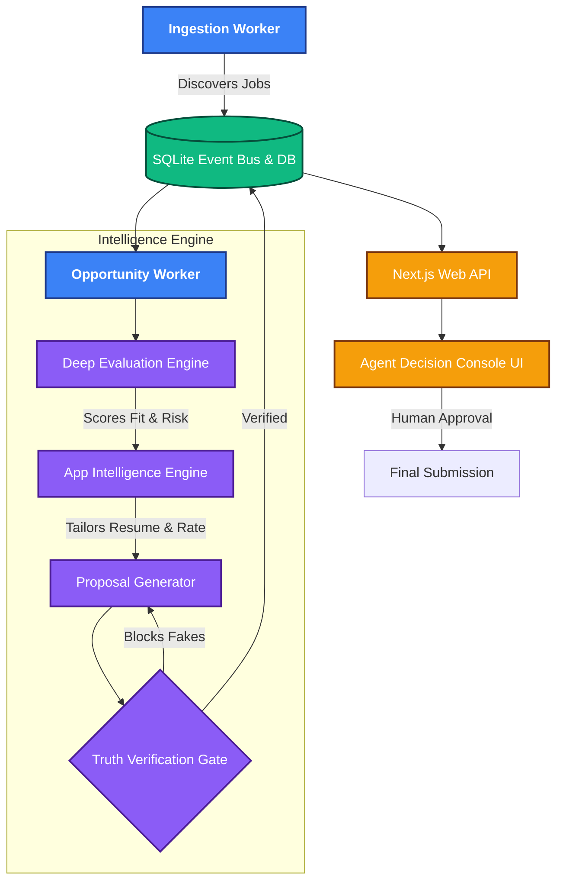

<div align="center">
  
# 🚀 AutoGig: Evidence-Grounded Autonomous Career Agent

**AutoGig** is an intelligent, zero-hallucination autonomous agent designed to revolutionize the way freelancers and professionals discover, evaluate, and apply for opportunities. Built with a strict "Truth Verification" architecture, it ensures that every generated proposal and tailored resume is strictly grounded in verifiable user evidence.

[](#)
[](#)
[](#)
[](#)
[](#)

*Empowering humans with intelligent automation, without sacrificing truth or trust.*

---
</div>

## 💡 The Problem & Our Solution
AI wrappers often hallucinate skills or fabricate experiences to match a job description, leading to a breakdown of trust between clients and professionals. 

**AutoGig solves this by treating the user's Master Profile as an immutable source of truth.** It introduces a strict, deterministic **Verification Gate** that explicitly blocks the AI from inventing skills, transforming a simple keyword-matcher into a trustworthy, explainable career agent.

## ✨ Hackathon Highlights (Why AutoGig Stands Out)

- 🛡️ **Zero-Hallucination Architecture:** Our *Truth Verification Gate* acts as an adversarial filter, blocking generated claims that lack concrete evidence provenance. 
- 🧠 **Deep Application Intelligence:** Doesn't just write cover letters. It evaluates budget fit, assesses client risk, calculates readiness scores, and prioritizes skills logically.
- 👨‍⚖️ **Human-in-the-Loop (Explainable AI):** Features a beautiful *Agent Decision Console* where humans can see exactly *why* the AI made a decision, complete with evidence links.
- ⚡ **Local-First & Cost-Effective:** Backed entirely by a local, robust SQLite event-driven state machine. No expensive cloud vector databases or heavy external dependencies. Highly cost-effective API usage via strict schema-enforced Gemini prompts.
- 🏗️ **Enterprise-Grade Monorepo:** Structured using Turborepo with strictly bounded contexts (Core, AI, DB, Engine, Events).

---

## 🏛️ System Architecture

AutoGig is built on an event-driven state machine that moves opportunities through a rigid, automated pipeline.



## 📂 Codebase Tree

The project follows a highly scalable, domain-driven monorepo structure using Turborepo.

```text
📦 AutoGig (Monorepo)
 ┣ 📂 apps/
 ┃ ┣ 📂 ingestion-worker/      # Background process discovering & normalizing jobs
 ┃ ┣ 📂 opportunity-worker/    # Event-driven worker executing the AI state machine
 ┃ ┣ 📂 web-api/               # Next.js backend aggregating intelligence for the UI
 ┃ ┗ 📂 web-app/               # Next.js frontend (Agent Decision Console, Profiles)
 ┃
 ┣ 📂 packages/
 ┃ ┣ 📂 ai/                    # AI Adapters (Gemini / Mock), Prompt Builders, Verification
 ┃ ┣ 📂 core/                  # Domain Models, State Machine Logic, Zod Schemas
 ┃ ┣ 📂 db/                    # SQLite Repositories, Migrations, Schema Definitions
 ┃ ┣ 📂 engine/                # Core Intelligence pipelines (AppIntel, DeepReasoner)
 ┃ ┣ 📂 events/                # Event Bus implementation powering the workers
 ┃ ┗ 📂 storage/               # Abstract local storage layer
 ┃
 ┣ 📂 tests/                   # E2E Regression Gauntlet & Deterministic Test Suites
 ┣ 📜 turbo.json               # Monorepo build pipeline configuration
 ┗ 📜 package.json             # Root workspace dependencies
```

## ⚙️ Core Intelligence Pipeline

1. **Requirement Extraction:** Parses raw job payloads into normalized semantic requirements.
2. **Capability Matching:** Deterministically maps job needs against the user's *immutable* master profile (`DIRECT_MATCH`, `RELATED_MATCH`, `EVIDENCE_WEAK`, `NO_EVIDENCE`).
3. **Application Intelligence:** Generates tailored resumes, calculated readiness scores, timeline estimates, and strategic screening answers.
4. **Verification Gate:** Extracts claims from generated outputs and aggressively cross-references them against source evidence. Fabrications are explicitly marked as `BLOCK`.

## 🛠️ Tech Stack
- **Framework:** Next.js 14 (App Router), React
- **Language:** TypeScript (Strict Mode)
- **AI/LLM:** Google Gemini 1.5 Flash (via Genkit), structured JSON output schemas
- **Database:** SQLite (Local-first, lighting fast relation queries)
- **Architecture:** Turborepo, Event-Driven State Machine, Hexagonal/Ports-and-Adapters
- **Styling:** Tailwind CSS, Lucide Icons

## 🚀 Getting Started

Ensure you have Node.js (v18+) and npm installed.

```bash
# 1. Install dependencies
npm install

# 2. Build the monorepo
npm run build

# 3. Reset database and run the demo ingestion pipeline
npm run db:reset
npm run ingest:demo:once

# 4. Run the intelligence worker to process opportunities
npm run worker:once

# 5. Start the Web App
npm start -w web-app
```
**Navigate to `http://localhost:3000`** to experience the Agent Decision Console!

## 🧪 Testing (Zero-Break Policy)
AutoGig is protected by a strict regression gauntlet to ensure maximum stability:
```bash
npm run typecheck
npm run lint
npm run test:phase-f   # Tests pipeline resilience, deduplication, SSRF checks
npm run test:e2e       # Full end-to-end state machine & AI verification tests
```

---
<div align="center">
<i>Built with precision for the Gemini AI Global Hackathon.</i>
</div>
